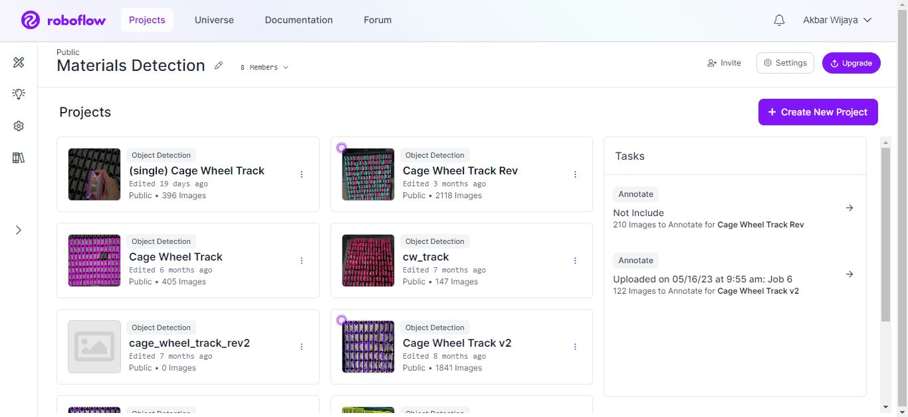

# Project Summary
Project Name : **Materials Detection - Object Countings**
<br>
Algorithm : **[YOLOV5]( https://github.com/ultralytics/yolov5) from Ultralytics**
<br>


# Quickstart
Clone this repository, and install all package inside `requirements.txt`.
```bash
$ git clone http://gitlab.quick.com/artificial-intelligence/object-countings.git     #clone
$ cd object-countings
$ pip install -r requirements.txt       #install
```
<br>

# Dataset
We're using custom dataset, so we're actually collecting the data itself. Then we use `app.roboflow.com` for giving label in every image.


For the complete information, go here [disini.](https://docs.ultralytics.com/yolov5/tutorials/train_custom_data/)

<br>

# Training and Testing
Snippet training and testing from Yolo

**Training Script**
```python
!python train.py --img 640 --batch-size 16 --epochs 300 --data '/yolov5/data/data.yaml' --weights 'yolov5s.pt'
```
**Testing Script**
```python
!python detect.py --weights '/path/of/weight.pt' --img 640 --conf 0.5 --source '/path/of/image/test' --hide-labels --line-thickness 2 
```
**Validation Script**
```python
!python val.py --img 640 --data '/yolov5/data/data.yaml' --weights '/yolov5/runs/train/exp/weights/best.pt' 
```
<br>

### Logging with Comet ML
Comet ML is a platform used to manage and analyze machine learning experiments. Comet ML can provide insight into model performance in machine learning experiments through tracking and visualizing experimental results.

**Using Comet ML**

```python
%pip install comet_ml --quiet   # install Comet ML

import comet_ml
comet_ml.init(project_name='object-countings')
```
_look the origin documentation from YOLOv5 with CometML [here](https://docs.ultralytics.com/yolov5/tutorials/train_custom_data/#comet-logging-and-visualization-new)._

<br>

### Add Model (Development)
For adding new model,
1. Training new model using notebook from YOLOv5.
2. _Paste_ file `best.pt` into folder weight_type, and rename it. ex: 'circle-pipe.pt'

<br>


### Materials Detection API
This project is mainly running with 2 API Process, with the endpoint:
* Get API Info 
  ```bash 
  GET   /v1/materials_detection
  ```
* Material Detection
  ```bash 
  POST   /v1/materials_detection
  ```

Look **[`api_documentation.md`](https://github.com/akbarwijayaa/object-countings/blob/main/api_documentation.md)** for the complete api documentation.

<br>


# <div align="left"><h3>API Documentation</h3></div>

# Endpoints
- ##  Get API Info
    This endpoint used for get the information about status API. Method is  **`GET`**
    <br>

    **Endpoint**
    ```bash
    GET   /v1/materials_detection
    ```

    **Response**
    ```json
    MATERIALS DETECTION
    ```
    <br>

- ## Materials Detection
    This endpoint used for get count all object in the images. Method is **`POST`**
    <br>

    **Endpoint**
    ```bash
    POST   /v1/materials_detection
    ```
    <br>

    **Request Body** `(form-data)` :
    * **`image`** _(file, required)_ : send image to detect.
    * **`obj_type`** _(string, required)_ : circle-pipe

    <br>

    **Example Request using CURL**
    ```bash
    curl --request POST 'http://localhost:5000/v1/materials_detection' \
    --header 'Host: localhost' \
    --header 'Content-Type: multipart/form-data; boundary=--------------------------641642483064404002925119' \
    --form 'image=@"/path/To/yourFolder/image.jpg"' \
    --form 'obj_type="cage_wheel_track_single"'
    ```
    <br>


    **Example Response**
    ```bash

    {
        "code": 200,       # status code
        "data": [          # data result detection
            {
                "height": 786,  
                "idx": 1,       
                "radius": 92.0, 
                "width": 230,   
                "xcenter": 180, 
                "ycenter": 454  
            },
            {
                "height": 766,
                "idx": 2,
                "radius": 164.0,
                "width": 410,
                "xcenter": 278,
                "ycenter": 453
            },

            ...

        ],
        "id_counting": 874,     # id counting for every detection
        "img_height": 3840,     
        "img_width": 2160,     
        "message": "Successfully",      
        "success": true,
        "time": "2.64s"      
    }
        
    ```

<br>


# Error Handling
Object Countings API menggunakan standar HTTP status code sebagai indikasi sukses/gagal sebuah request.
* **200** _OK_

* **400** _bad request_

* **403** _forbidden_

* **404** _notfound_

* **405** _method not allowed_

* **408** _request timeout_

* **500** _internal server error_

* **502** _bad gateway_

* **503** _service unavailable_

* **504** _gateway timeout_